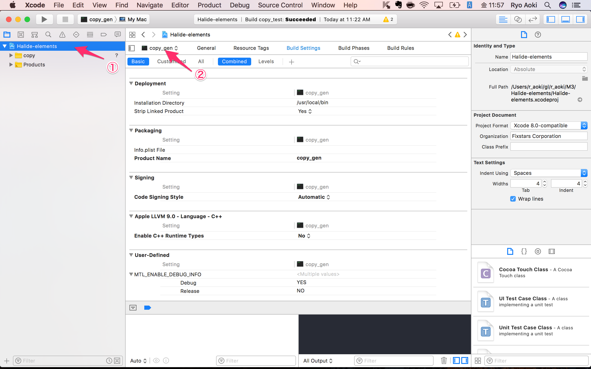
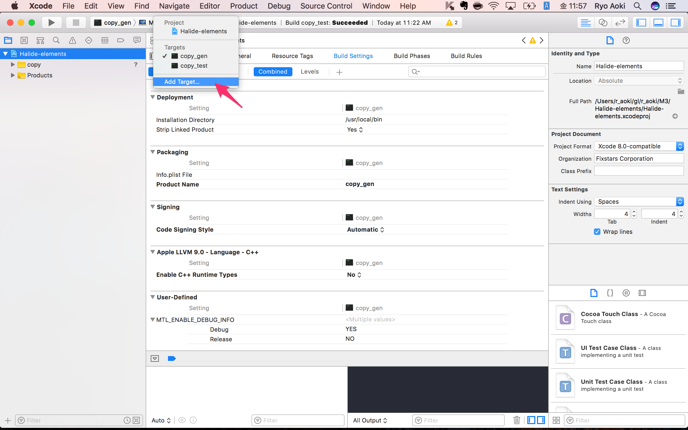
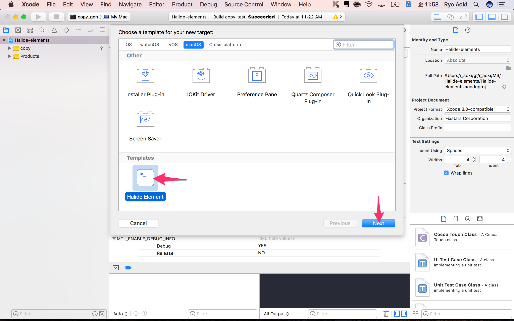
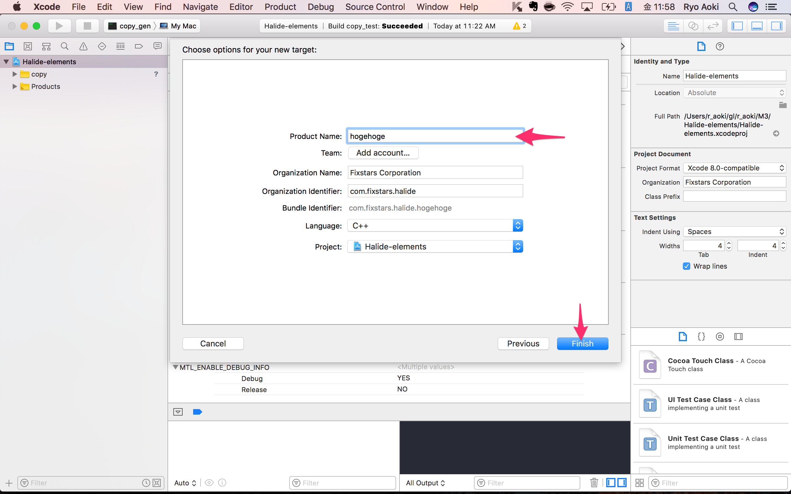
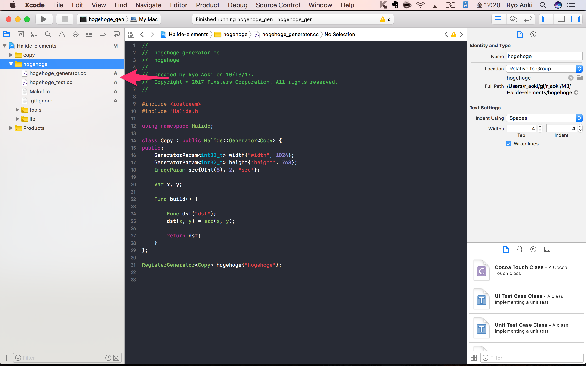
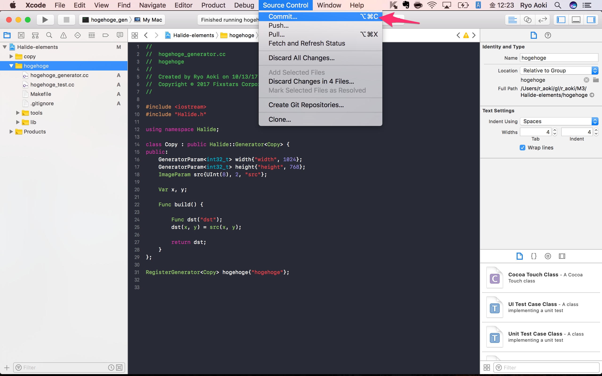
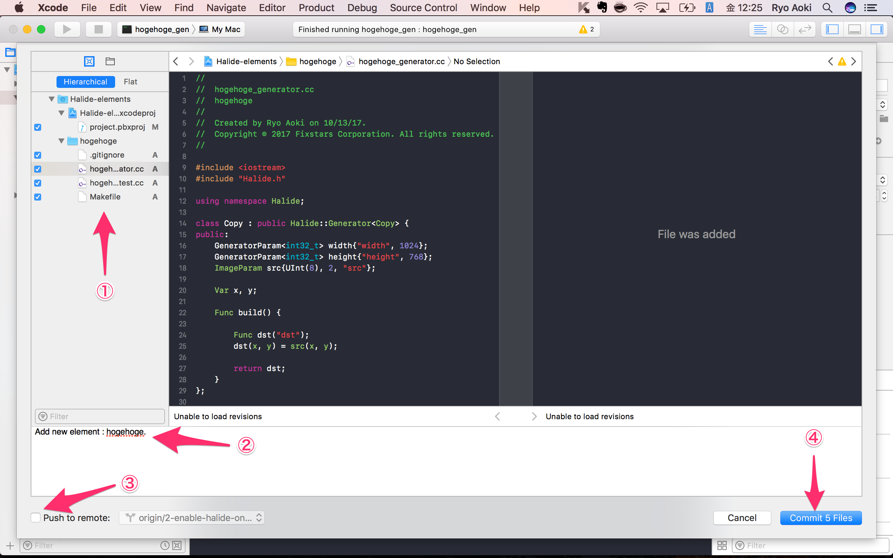
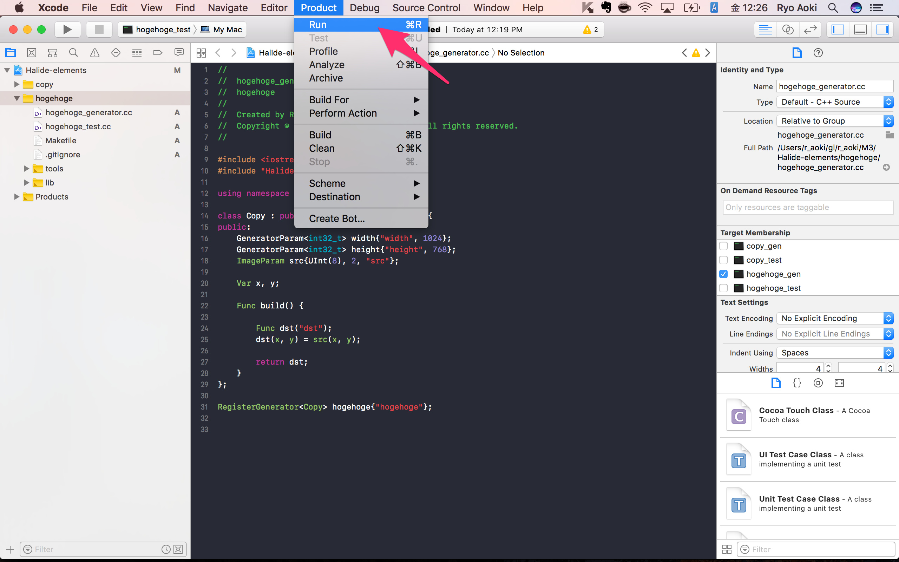

# Xcode を使った Halide Element の開発

## 準備

準備は下記の3ステップです。

1. Xcode のインストール
2. Halide のインストール
3. Halide Element 開発向け、Xcode プロジェクトテンプレートのインストール

### Xcode のインストール

まずは 最新の Xcode をインストールしてください。Git や Clang 等もインストールされます。
Xcode による、コメントなどの自動生成で日本語が使用されるのを抑制するため、インストール後に下記コマンドを実行してください。ロケールが英語に変更されます。

```
$ defaults write com.apple.dt.Xcode AppleLocale en_US
```

### Halideのインストール

[Homebrew](https://brew.sh/) を使った自動インストールと手動でのインストールを選べます。後々、Halide のバージョンを頻繁に切り替えることを想定すると、Homebrew がおすすめです。  
※ Homebrew は macOS 向けの簡易パッケージマネージャです。

#### Homebrew を使った自動インストール

1. 下記コマンドを実行し、Homebrew および Halide をインストールします。

```
### install homebrew

$ /usr/bin/ruby -e "$(curl -fsSL https://raw.githubusercontent.com/Homebrew/install/master/install)"

### install halide

$ brew tap ryo-aoki/halide

$ brew install halide
```

#### 手動インストール

1. https://github.com/halide/Halide/releases から [macOS 用 Halide バイナリ(64bit)](https://github.com/halide/Halide/releases/download/release_2017_05_03/halide-mac-64-trunk-06ace54101cbd656e22243f86cce0a82ba058c3b.tgz) をダウンロードし、解凍します。ここでは、```~/Downloads``` フォルダに解凍した前提とします。

2. 解凍すると、```halide``` フォルダが展開されます。フォルダ内から必要なファイルを ```/usr/local/``` 以下へ展開します。

```
$ sudo cp -a ~/Downloads/halide/include/* /usr/local/include/

$ sudo cp -a ~/Downloads/halide/bin/* /usr/local/lib

$ sudo mkdir -p /usr/local/share/halide

$ sudo cp -a ~/Downloads/halide/tools /usr/local/share/halide
```

### Halide Element 開発向け、Xcodeプロジェクトテンプレートのインストール

本リポジトリ(Halide-elements)内の macOS フォルダから Halide Element 開発向けに作成した、Xcode プロジェクトテンプレートを下記コマンドでインストールします。

```
$ cp -a macOS/Xcode\ Project\ Templates/ ~/Library/Developer/Xcode/Templates
```

## Element の新規追加方法

1. Xcode で src/Halide-elements.xcodeproj を開く
2. Project Navigator から、プロジェクトファイル (Halide-elements) を選択する

3. ターゲット名のプルダウンリストから Add Target... を選択する

4. テンプレートから Halide-elements を選択する

5. 開発するElementの名前を "Product Name" のテキストボックスに任意に設定する

7. "Product Name"/"Product Name"_generator.cc に HalideDSL のコードを記述する
8. "Product Name"/"Product Name"_test.cc にテストコードを記述する


## 既存 Element の追加方法
1. 追加対象のElementのフォルダをバックアップする。
2. Element の新規追加方法の5まで実行する。
3. ```cp -a path/to/backup src/``` などと実行して上書きする。

## Element のコミット
1. Source Control > Commit... を選択

2. ①コミットする対象を選び、②コミットメッセージを書き、③すぐにPushするならチェックを入れて、④コミットする


## Element のテスト
1. テストするターゲットを選択するため、ターゲットリストを開く

2. テストしたいターゲットを選択する

3. Product > Run を選択する

